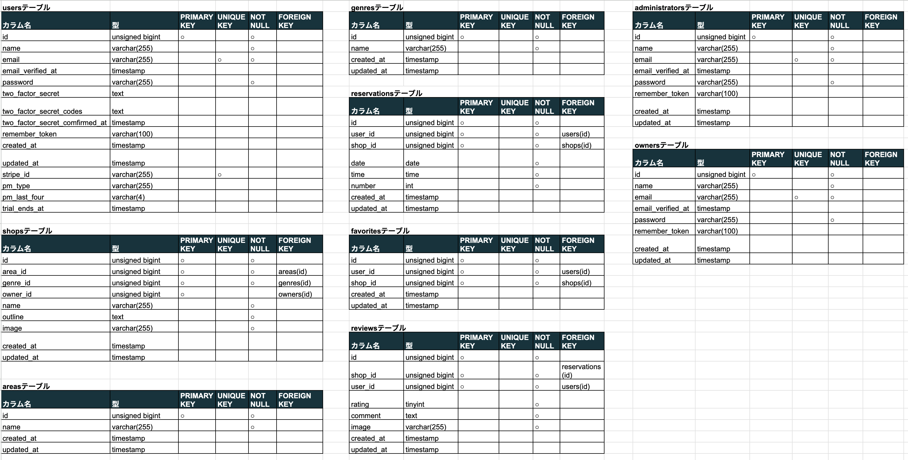

# Rese
グループ会社の飲食店予約サービスです。お気に入り登録や検索機能があります。  
予約の変更や削除もマイページからできます。  
管理者権限で店舗代表者の登録ができ、店舗代表者は新規店舗の登録や編集が可能です。  


## 作成した目的
外部の飲食店予約サービスでは手数料が発生するため、自社で予約サービスを作成しました。

## アプリケーションURL
* 開発環境 : http://localhost/  
左上のハンバーガーメニューから会員登録が可能です。
会員登録にはメール認証が必要であり、メール認証はMailHogを利用しています。  
会員登録後、MailHogにアクセスし認証メールが届いていれば認証ボタンを押してください。  
  * MailHog : http://localhost:8025  
* 管理者画面 : http://localhost/admin  
シーディングでテストユーザーを登録しています。
  ```text
  名前：hoge01  
  メールアドレス：admin001@example.com  
  パスワード：pass0001
  ```
* 店舗代表者画面 : http://localhost/owner  
シーディングでテストユーザーを登録しています。
  ```text
  名前：hoge01  
  メールアドレス：owner001@example.com  
  パスワード：pass0001
  
  名前：hoge02  
  メールアドレス：owner002@example.com  
  パスワード：pass0002
  
  名前：hoge03  
  メールアドレス：owner003@example.com  
  パスワード：pass0003
  ```
* phpmyadmin : http://localhost:8080

## 機能一覧
* 飲食店一覧取得  
* 飲食店詳細取得  
* 検索機能  
ジャンル、エリア、店名で検索できます。
* 会員登録・ログイン・ログアウト機能  
会員登録時にメール認証機能があります。
* 飲食店の予約機能  
* お気に入り登録機能  
ログイン後、飲食店の予約やお気に入り登録ができます。
* ユーザー毎の予約やお気に入り登録の情報取得  
マイページから予約やお気に入り登録の確認、変更、削除ができます。
* 飲食店の評価機能  
予約日が過ぎた飲食店に関しては、マイページから５段階評価とコメントができます。
* 管理者機能  
  * 店舗代表者登録  
  * お知らせメール送信  
管理者画面から管理者権限でログインすると、上記機能が使用できます。  
お知らせメールはユーザー登録されている全員に送信されます。
*  店舗代表者機能  
   *  新規店舗登録機能（画像のストレージ保存機能）  
   *  既存の店舗更新機能
   *  予約情報一覧取得  
店舗代表者画面から店舗代表者権限でログインすると、上記機能が使用できます。  
新規店舗登録、既存の店舗更新時の店舗画像はストレージに保存されます。  
予約情報は店舗代表者が管理している店舗の予約のみ表示されます。  
*  決済機能  
マイページの予約一覧からレビュー投稿画面へ進むと購入画面へ進むことができます。  
例として1万円の決済ができるようになっています。  
   ```text
   テスト用カード情報 4242 4242 4242 4242  
   使用期限 任意の数字　　セキュリティーコード 任意の数字  
   名前 任意の名前  
   ```
*  リマインダー機能  
予約当日の9時にリマインダーメールが送られます。

## 使用技術
1. Laravel Framework 8.83.27
2. PHP 7.4.9
3. MYSQL 8.0.26
4. nginx 1.21.1
5. phpmyadmin 5.2.1
6. DockerCompose 2.27.1

## テーブル設計


## ER図


## 環境設定
**Dockerビルド**
1. `git@github.com:Haruka-Wada/Rese.git`
2. DockerDesktopアプリを立ち上げる
3. `docker-compose up -d --build`

**Laravel環境構築**
1. `docker-compose exec php bash`
2. `composer install`
3. 「.env.example」ファイルを「.env」ファイルに名称変更。または、新しく「.env」ファイルを作成  
4. .envに以下の環境変数を追加
```text
DB_CONNECTION=mysql  
DB_HOST=mysql  
DB_PORT=3306  
DB_DATABASE=laravel_db  
DB_USERNAME=laravel_user  
DB_PASSWORD=laravel_pass  

MAIL_MAILER=smtp  
MAIL_HOST=mailhog  
MAIL_PORT=1025  
MAIL_USERNAME=null  
MAIL_PASSWORD=null  
MAIL_ENCRYPTION=null  
MAIL_FROM_ADDRESS="rese@example.com"  
MAIL_FROM_NAME="${APP_NAME}"  

STRIPE_KEY=pk_test_51QWrFuFZPeEzOxnh5M4VmsK8zaKBF4JiSePQMMhsw45E4JWuBDFu4iiz8aORNBSOhO5S5LpxhbybFsjJzpTLONkF00FqMvcVFi
STRIPE_SECRET=sk_test_51QWrFuFZPeEzOxnhfTI4whtcQS8U2AiuuyVkbJV9WwFbffcYjizy5hmkauYiIodKQz7LaN2TmuPy2aA9jTBMNErP00KXwzn8io
```
4. アプリケーションキーの作成
```bash
php artisan key:generate
```
5. マイグレーションの実行
```bash
php artisan migrate
```
6. シーディングの実行
```bash
php artisan db:seed
```
7. その他

